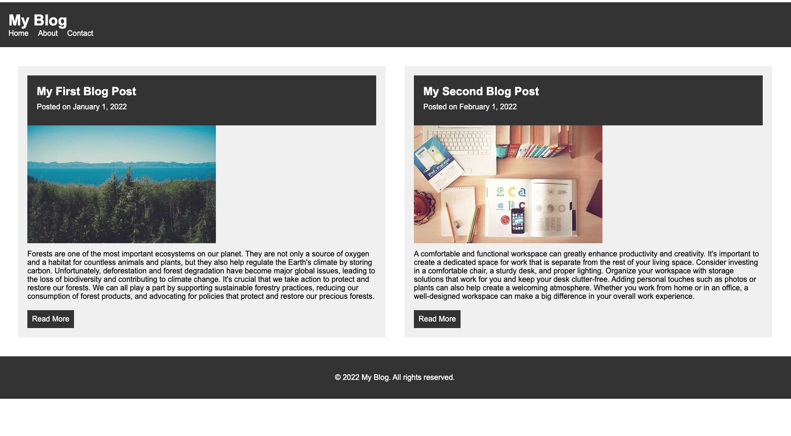

# First Blog

This is a simple blog written with HTML, CSS and JavaScript.

## Running with Docker

To run this project using Docker, follow these steps:

1. Install Docker on your machine if you haven't already done so.
2. Clone this repository to your local machine.
3. Open a terminal window and navigate to the root directory of this project.
4. Build the Docker image by running the following command:
    ```sh
    docker build .
5. Once the image is built, you can start the container by running the following command:
    ```sh
    docker-compose up
6. The website will be available at [http://localhost:8080](http://localhost:8080).

That's it! You now have a Docker container running the First Blog website.

Here's a screenshot of what the website should look like:


   

